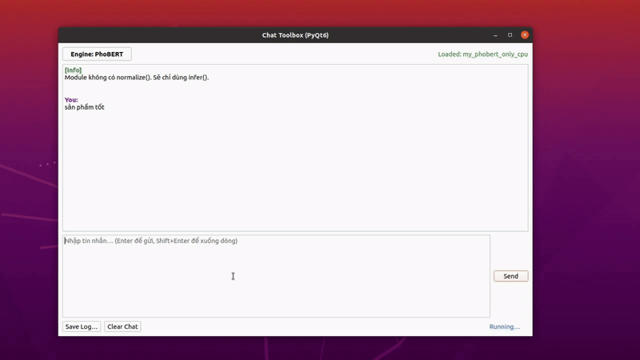

# Vietname review sentiment


<p align="center">
  
</p>

## Environment

    git clone git@github.com:ntdathp/vn-review-sentiment.git
    cd nlp_learning

> For TFIDF, Phobert python version 3.10.18

<details>
  <summary> For virtual environment. Click here to expand</summary>

    # Install pyenv + build deps (Ubuntu/Debian)
    sudo apt update
    sudo apt install -y build-essential libssl-dev zlib1g-dev \
    libbz2-dev libreadline-dev libsqlite3-dev curl llvm \
    libncursesw5-dev xz-utils tk-dev libxml2-dev libxmlsec1-dev \
    libffi-dev liblzma-dev
    curl https://pyenv.run | bash
    
    # Add pyenv to shell
    echo 'export PYENV_ROOT="$HOME/.pyenv"' >> ~/.bashrc
    echo 'command -v pyenv >/dev/null || export PATH="$PYENV_ROOT/bin:$PATH"' >> ~/.bashrc
    echo 'eval "$(pyenv init -)"' >> ~/.bashrc
    exec $SHELL  # hoặc: source ~/.bashrc
    
    # Install Python 3.10.18
    pyenv install 3.10.18
    pyenv local 3.10.18     
    python -V                # check Python 3.10.18

    # Create and activate venv
    python -m venv .venv310
    source .venv310/bin/activate
    python -V  # 3.10.18
    pip install --upgrade pip setuptools wheel
    
</details>


```
pip install -r requirements310.txt
```

> For BiLSTM python version 3.8.10

<details>
  <summary> For virtual environment. Click here to expand</summary>

    # Install pyenv + build deps (Ubuntu/Debian)
    sudo apt update
    sudo apt install -y build-essential libssl-dev zlib1g-dev \
    libbz2-dev libreadline-dev libsqlite3-dev curl llvm \
    libncursesw5-dev xz-utils tk-dev libxml2-dev libxmlsec1-dev \
    libffi-dev liblzma-dev
    curl https://pyenv.run | bash

    # Add pyenv to shell
    echo 'export PYENV_ROOT="$HOME/.pyenv"' >> ~/.bashrc
    echo 'command -v pyenv >/dev/null || export PATH="$PYENV_ROOT/bin:$PATH"' >> ~/.bashrc
    echo 'eval "$(pyenv init -)"' >> ~/.bashrc
    exec $SHELL   # or: source ~/.bashrc

    # Install Python 3.8.10
    pyenv install 3.8.10
    pyenv local 3.8.10
    python -V    # check Python 3.8.10

    # Create and activate venv
    python -m venv .venv38
    source .venv38/bin/activate
    python -V    # 3.8.10
    pip install --upgrade pip setuptools wheel

    
</details>

```
pip install -r requirements38.txt
```
## Training

For training see the train_xxx.py.


## TF-IDF + (Logistic Regression/Linear SVM)

Download trained model [here](https://drive.google.com/drive/folders/1PL8SkWgrvDVAQdxvvBom4vErmJ3N9AQj?usp=sharing). Remember to extract zip file.

> Change the path to the trained model in the jupyter notebook.

```python
MODEL_PATH = Path("tfidf_baseline.joblib")
```

# BiLSTM

Download trained model [here](https://drive.google.com/drive/folders/1l7w9Y-VihGvjwxzucRqFgp9jTztnL5x9?usp=drive_link). Remember to extract zip file.

> Change the path to the trained model in the jupyter notebook.

```python
MODEL_DIR = "/home/dat/llm_ws/bilstm/bilstm_vn_sentiment_5cls" 
```

## Phobert with GUI

> Change the path to the trained model in **`phobert/my_phobert_only_cpu.py`** or **`phobert/my_phobert_only.py`**, depending on whether you want to run on **CPU** or **GPU**.

- **CPU:** edit [`my_phobert_only_cpu.py`](phobert/my_phobert_only_cpu.py)
- **GPU:** edit [`my_phobert_only.py`](phobert/my_phobert_only.py)

Download trained model [here](https://drive.google.com/drive/folders/1VI1AyaTUFOaKDCyZbS8mfxUguh9thrt9?usp=sharing). Remember to extract zip file.

```python
_DEF_CANDIDATES: List[str] = [
    os.environ.get("PHOBERT_MODEL_DIR", ""),                
    "/home/dat/llm_ws/phobert/phobert_5cls_clean",           # path 
]
```
Then choose **my_phobert_only_cpu** or **my_phobert_only in** **`chat_toolbox.py`**.

```python
mod_name = os.environ.get("CHAT_TOOLBOX_PHOBERT_MODULE", "my_phobert_only_cpu")
```

Finally run the GUI.
```
cd phobert
python chat_toolbox.py
```


## Local LLM

Pull model from ollama.

```
ollama pull <model_name>
```

>Change the **MODEL_NAME** in the jupyter notebook.

```python
MODEL_NAME = "<model_name>"
```
